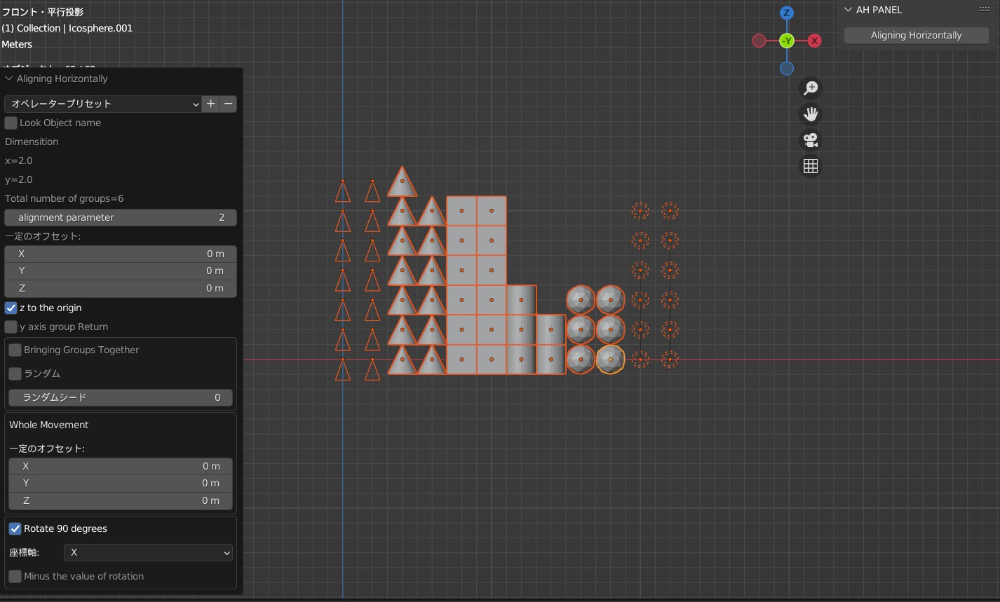
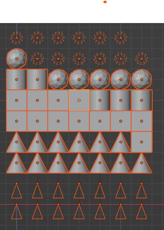
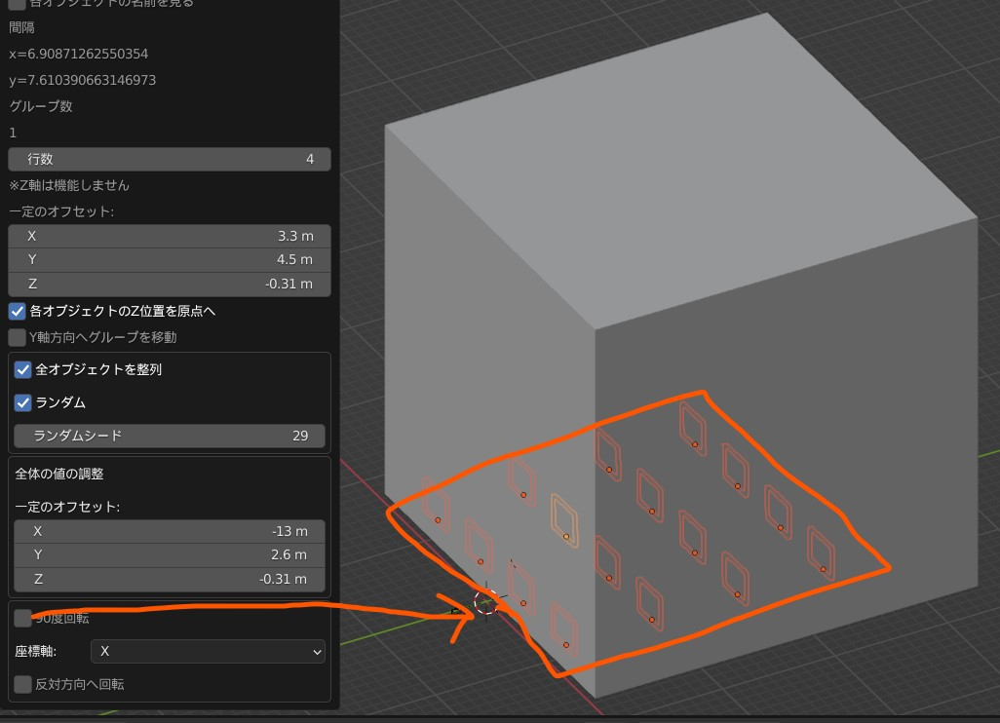
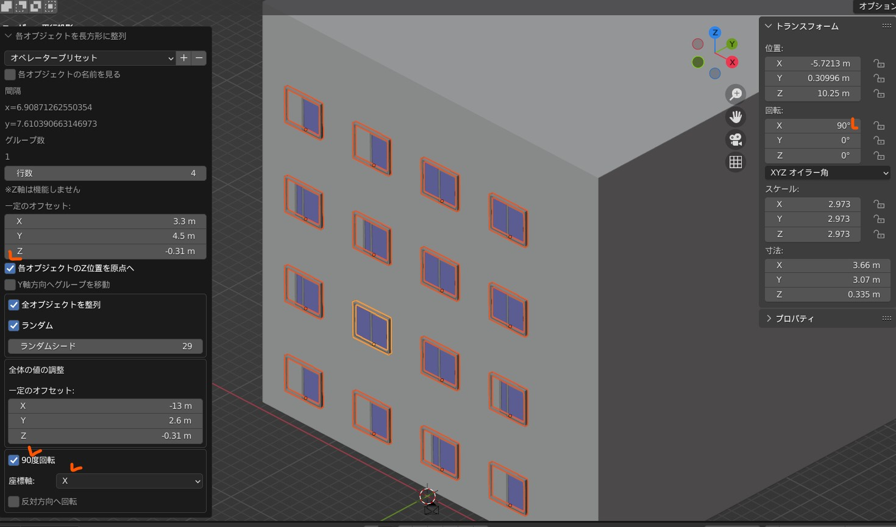

# aligning_horizontally

***●●どの様なアドオンか？●●***

なんとなくそれっぽい感じで各オブジェクトを長方形状に整頓できます。

***●具体的にどんな時に使えますかね？***

同じ寸法に近いオブジェクトに対して効果が発揮します。

例えば、予め用意しておいた異なる窓のオブジェクトを壁に均等に配置するなど。

五目並べのオブジェクトを作成など…。

---

***●注意点***

・各寸法はオブジェクト個々の中の最大値の寸法を流用してますので、

極端に大きすぎるオブジェクトがあると、

各オブジェクトの幅が広がりすぎる事になります。

・回転前のXYZの寸法が適応されますのであらかじめ回転を適応してくか

その選択の親オブジェクトに回転が適応されてるか設定しておく必要があります。

・子オブジェクトがあるオブジェクトの場合は、

親オブジェクトのみ選択すると子も同時に移動します。

（親オブジェクトはアウトライナーから選択しておくと便利です）

この際は親オブジェクトの寸法が適応されます。

***●概要***

基本的にX軸とY軸を基準に整列されます。
整列基準の原点はワールドの（0，0，0）が基準になります。
後で各方向に90回転・微調整できますので、
お好みに合わせて調整して下さい。

***●機能***

各オブジェクトの名前を基準にグールプ化する機能が標準です。

グループモード

| グループモード                                                                                                                                                                                       | 全体モード                                     |
| ---------------------------------------------------------------------------------------------------------------------------------------------------------------------------------------------------- | ---------------------------------------------- |
|  |  |

特にグールプ化する必要がない場合は
「全オブジェクトを整列（Bringing Groups Together）」をオンにして頂くと全てまとめて整列していきます。

すべてまとめて整列した際、ランダムにオブジェクトを配置する機能が実行できます。

●アレンジ

窓のように最初から縦に整列して調整したい場合は、

オブジェクトをX軸に90度回転しておきます。

※90度回転した状態で通常の状態にしておく。

後は設定で全体の90度を回転にチェックを入れておけば縦での整列も可能です。

ただ、この場合はZ軸とY軸がセッテイングで入れ替わるのでご注意下さい。

